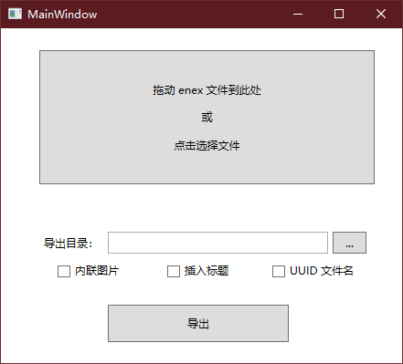

- EnexFile 是一个库，用来读取 .enex 文件，并转换为 markdown
- EnexDump 是一个简单的 WPF GUI 程序

## 特性

- 读取 .enex 文件内的所有细节
- 导出为 markdown
- 支持以 base64 的形式内联保存图片

## 截图

## 下载

<https://github.com/wzv5/enex/releases/latest>

## 实现细节

.enex 文件本质是个 xml 文件，evernote 官方提供了 .dtd 格式定义文件，根据 .dtd 文件写出实体类，然后直接调用 `xmlSerializer` 就能反序列化读取出来。

## 感谢

- [ReverseMarkdown](https://github.com/mysticmind/reversemarkdown-net)：实现 html 到 markdown 的转换

## License

MIT
